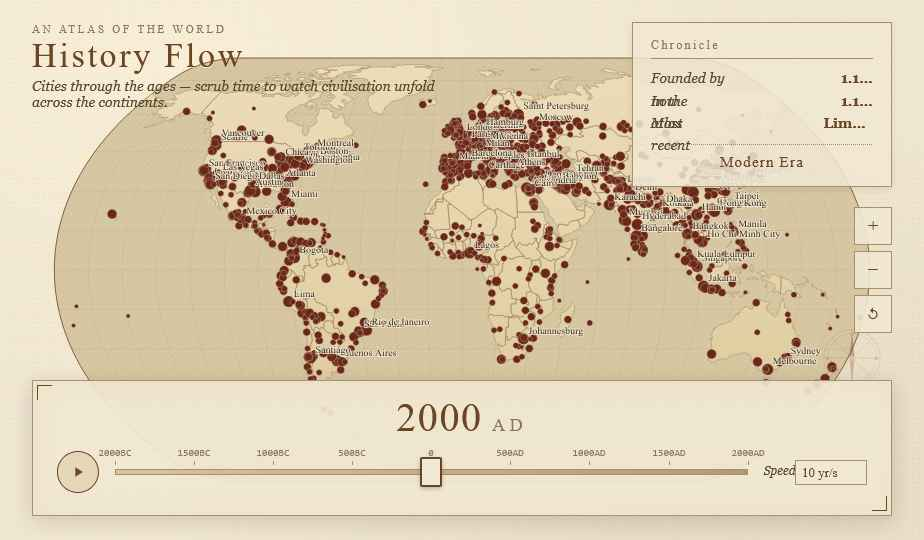

# History Flow

An interactive historical atlas that animates 12,000 years of human civilization — city foundations and famous people plotted on a world map, revealed as you move through time.



## Running locally

Requires [Node.js](https://nodejs.org) (v18 or later).

```
node server.js
```

Open **http://localhost:3000** in your browser.

> **Note for Windows users:** use `node server.js` directly rather than `npm start` to avoid PowerShell execution policy restrictions.

## Controls

| Action | How |
|--------|-----|
| Play / pause animation | Click the ▶ button or press **Space** |
| Step through time | **←** / **→** arrow keys (hold **Shift** for ×10 jumps) |
| Jump to start / end | **Home** / **End** |
| Pan the map | Click and drag |
| Zoom | Scroll wheel, or the **+** / **−** buttons |
| Reset zoom | The ↺ button |
| Inspect a dot | Click it — opens a detail card |
| Hover a dot | Shows a tooltip |
| Toggle tweaks panel | The **T** button (dot size, glow, speed, borders) |

## Datasets

Switch between datasets with the **Showing** dropdown in the top-left:

- **City Foundations** — ~600 historically significant cities, plotted by earliest recorded founding date. Dot size reflects historical importance (1–5 scale).
- **Famous People (Pantheon)** — 3,434 historical figures from the [Pantheon 1.0](https://pantheon.world) dataset (MIT Media Lab, CC BY 4.0), plotted by birthplace. Dot size reflects Historical Popularity Index (HPI). Coloured by domain:
  - Arts · Science · Leadership · Sports · Religion · Humanities
- **Both Layers** — cities and people overlaid simultaneously.

Click any domain label in the legend to toggle that category on/off.

## Project layout

```
historyflow/
├── server.js           # Local dev server (zero dependencies)
├── package.json
└── project/
    ├── index.html      # App shell + all CSS
    ├── app.js          # Rendering and interaction logic
    └── data/
        ├── cities.js        # City dataset
        ├── people.js        # Pantheon people dataset
        └── world-110m.json  # World atlas (TopoJSON, downloaded locally)
```

## Editing

The project is designed to be edited with [Claude Code](https://claude.com/code). A `CLAUDE.md` file at the root documents the architecture, data formats, and key globals for the coding agent.

Common things to edit:

- **Add cities or people** — extend the arrays in `project/data/cities.js` or `project/data/people.js` following the existing format
- **Change the visual style** — all CSS variables (`--paper`, `--sepia`, `--ink`, etc.) are in the `<style>` block at the top of `project/index.html`
- **Adjust default tweaks** — edit the `TWEAK_DEFAULTS` object in `project/index.html`
- **Change the time range** — `YEAR_MIN` and `YEAR_MAX` constants at the top of `project/app.js`

## Dependencies

All loaded from CDN at runtime (no build step):

- [D3.js v7](https://d3js.org) — map projection, zoom, data binding
- [TopoJSON v3](https://github.com/topojson/topojson) — world geometry decoding
- [EB Garamond, IM Fell English SC, JetBrains Mono](https://fonts.google.com) — typefaces
